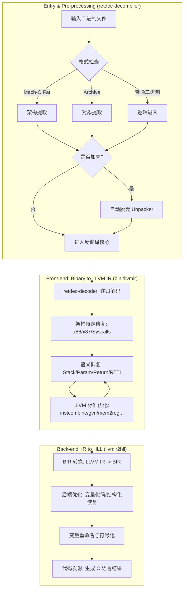

# RetDec 反编译器编排与配置详解

本文档结合 `retdec-decompiler.cpp` 源码与 `decompiler-config.json` 配置文件，详细解析 RetDec 的执行流程调度与配置参数含义。

## 0. RetDec 核心工作流程图



## 1. 核心流程指挥官：retdec-decompiler

`retdec-decompiler.cpp` 是 RetDec 命令行工具的入口，负责编排整个反编译生命周期：

### 主要职责
1.  **环境配置**：管理内存上限（默认系统 RAM 的 50%）和超时控制（防止复杂二进制导致死循环）。集成 LLVM 的调试日志开关。
2.  **前置处理**：
    -   **Mach-O 提取**：处理苹果平台的 Fat Binary，提取指定架构。
    -   **归档提取**：从 `.a` / `.lib` 静态库中提取目标对象。
    -   **自动脱壳**：集成调用 `retdec-unpacker` 对受保护的二进制进行还原。
3.  **任务执行**：加载配置文件，将命令行参数注入配置对象，并最终调用 `retdec::decompile(config)` 启动分析链。
4.  **善后清理**：执行完成后删除临时提取或脱壳产生的中间文件。

---

## 2. 配置参数详解：decompiler-config.json

`decompiler-config.json` 定义了反编译器的默认行为和 Pass 执行序列。

### 基础参数 (`decompParams`)
*   **`verboseOut`** (bool): 是否输出详细的阶段日志。
*   **`outputFormat`** ("plain"|"json"): 最终生成的 C 代码格式。`plain` 为标准 C 分格。
*   **`keepAllFuncs`** (bool): 是否保留所有函数。设为 false 则移除 main 函数不可达的部分。
*   **`detectStaticCode`** (bool): 是否开启基于 Yara 签名的静态链接库函数识别。
*   **`timeout`** / **`maxMemoryLimit`**: 超时（秒）与内存（字节）限制。

### 后端与优化控制
*   **`backendCallInfoObtainer`** ("optim"|"pessim"): 函数调用参数识别策略。`optim` 倾向于识别更多参数，`pessim` 则更保守。
*   **`backendVarRenamer`** ("readable"|"address"|...): 变量命名风格。`readable` 生成类似 `v1`, `v2` 的名称，`address` 使用原始偏移量命名。
*   **`backendNoOpts`** (bool): 若为 true，则跳过所有后端 BIR 优化，直接从 IR 生成 C。
*   **`backendKeepLibraryFuncs`** (bool): 是否在生成的 C 代码中显示识别出的库函数（如 `printf`）的函数体。
*   **`backendEmitCfg`** / **`backendEmitCg`**: 是否导出控制流图 (DOT) 和调用图。

### 资源路径设置
*   **`staticSignPaths`**: Yara 签名文件路径，用于识别库函数。
*   **`libraryTypeInfoPaths`**: JSON 格式的库函数原型库（LTI），用于恢复精确的参数类型。
*   **`cryptoPatternPaths`**: 用于识别常见加密算法（如 AES/MD5）常量特征的签名。

---

## 3. Pass 编排序列 (`llvmPasses`)

这是 RetDec 最核心的设计。`llvmPasses` 数组定义了 Pass 的**精确执行顺序**。RetDec 并不像标准的 clang 优化那样只运行一遍，它的序列是精心交织的：

1.  **解码与基础分析**：首先运行 `retdec-provider-init` 和 `retdec-decoder`。
2.  **交替优化**：
    -   可以看到 LLVM 标准 Pass (如 `instcombine`, `simplifycfg`, `early-cse`) 与 RetDec 自定义 Pass (如 `retdec-stack`, `retdec-constants`) **反复交叉运行**。
    -   原因：RetDec 的 Pass（如还原栈变量）会产生新的 IR 结构，这些结构需要 LLVM 标准 Pass 进一步清理，清理后的 IR 又能支撑更高级的 RetDec 分析（如类型恢复）。
3.  **后端转换**：序列最后以 `retdec-write-ll`, `retdec-write-bc` 和最终的 `retdec-llvmir2hll` 结束，完成从 LLVM 世界到 C 语言世界的跨越。

> [!TIP]
> 如果要调试特定的反编译问题，可以通过修改此 JSON 中的 `llvmPasses` 序列来临时禁用或调整某个 Pass 的执行位置。

---

## 4. 地址映射持久化 (Address Mapping Persistence)

RetDec 的一个核心设计目标是**可追踪性**。为了实现这一点，它利用 LLVM IR 的元数据（Metadata）机制，将 IR 指令与二进制地址始终“锁”在一起。

### 4.1 元数据节点 (`!insn_addr`)
在 `retdec-decoder` 阶段，每条被解码的机器指令都会生成一个唯一的 LLVM 元数据节点，记录其原始虚拟地址（Virtual Address）。
```llvm
!5271 = !{i64 127424} ; 对应十六进制 0x1F1C0
```

### 4.2 映射策略与粒度处理

在实际的反编译过程中，指令与地址之间并不是简单的 1:1 关系，RetDec 采用了以下策略来规划：

#### A. 一对多：指令提升 (Lifting)
- **场景**：一条复杂的机器指令（如 ARM 的 `pop {r1, r2, pc}`）实际上执行了多次内存读取和多次寄存器写入。
- **规划**：在 `retdec-decoder` 阶段，这条机器指令会被提升为多条 LLVM IR 指令。**所有**这些生成的 IR 指令都会指向**同一个**地址元数据节点。
- **结果**：在输出的 `.ll` 文件中，你会看到连续多行指令带有相同的 `!insn_addr !XXXX` 标记。

#### B. 多对一：指令合并 (Optimization)
- **场景**：LLVM 的优化 Pass（如 `instcombine`）可能会将多条细碎的指令合并为一条更高效的指令。
- **规划**：
    - **启发式选择**：RetDec 会遵循“主导指令”原则。通常会保留这组指令中“第一条”或“最关键一条”原始指令的地址。
    - **元数据舍弃**：在极少数情况下，如果多条完全无关的指令被某种极致优化合并，为了不引起语义歧义，可能会舍弃部分中间地址，仅保留最终计算结果所属的地址。
- **结果**：虽然某些中间地址在 IR 层面“消失”了，但由于 RetDec 在 `decompiler-config.json` 中精心交织了自定义分析 Pass，关键的语义点（如函数调用、全局变量访问）通常都会成功保留其原始地址。

#### C. 后端折叠：BIR 阶段
在转换到 BIR（后端中间表示）时，多个逻辑相关的 IR 指令会被进一步归纳为高级语句（如 `IfStmt`, `WhileLog`）。此时，BIR 节点通常会携带这组 IR 指令中最具代表性的起始地址，作为最终 C 代码注释的来源。

### 4.3 持久化传递机制
在后续的 60 多个 Pass 转换中，RetDec 遵循以下原则：
- **继承性**：当一个优化 Pass（如 `instcombine`）将几条旧指令合并成一条新指令时，新指令通常会继承旧指令中最具代表性的地址元数据。
- **保护性**：自定义 Pass（如 `retdec-value-protect`）会专门锁定某些关键位置的元数据，防止被 LLVM 的标准清理 Pass 误删。
- **作用**：这种持久化机制允许 RetDec 在最后生成的 C 代码中添加诸如 `// 0x1f1c0` 这样的地址注释，极大地方便了逆向分析人员在源码与汇编之间比对。

> [!NOTE]
> 这也是为什么 RetDec 生成的 `.ll` 文件非常巨大的原因。元数据表往往占据了文件的一半以上。
