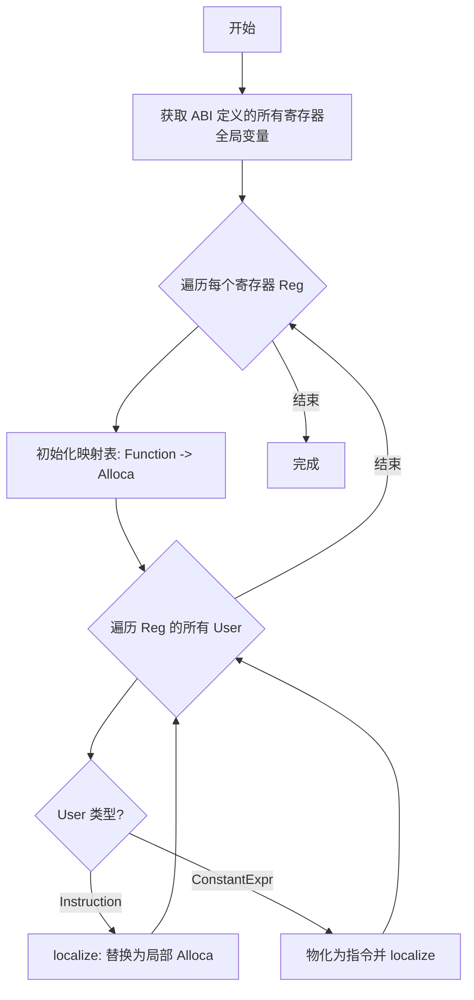

# retdec-register-localization

`retdec-register-localization` 是 RetDec 中的一个 LLVM Pass，用于将原本作为全局变量建模的硬件寄存器（Registers）转换为函数内部的局部变量（Local Variables）。

## 功能概述

在反编译的初期阶段，RetDec 将处理器的物理寄存器（如 x86 的 `eax`, ARM 的 `r0`）建模为 LLVM 的全局变量。这种方法虽然直观，但会导致 LLVM 的许多局部分析（如基于栈的优化、SSA 转换等）难以在寄存器上发挥作用。`retdec-register-localization` 的任务是将这些全局寄存器“局部化”到每个函数内部，赋予它们更好的数据流特性。

## 详细算法分析

`retdec-register-localization` 的实现逻辑非常精练，其核心在于对 LLVM 使用者树（User Tree）的遍历和替换。

### 算法流程

该 Pass 的算法逻辑如下：

1.  **准备阶段**：
    -   获取 ABI 信息，识别出目标架构的所有寄存器对应的全局变量集合。

2.  **寄存器遍历**：
    -   遍历 ABI 中定义的每一个寄存器全局变量。

3.  **引用定位与分析**：
    -   遍历该寄存器全局变量的所有使用者（Users）。
    -   **直接指令引用**：如果使用者是 LLVM 指令（如 `LoadInst` 或 `StoreInst`），则识别其所属的函数。
    -   **常量表达式引用**：如果使用者是 `ConstantExpr`（例如寄存器的地址被取偏移），则需要将其“物化”（Materialize）为实际指令，并插入到相应的位置。

4.  **局部化替换（`localize`）**：
    -   **创建局部变量**：对于每一个使用了该寄存器的函数，在函数的入口块（Entry Block）创建一个 `AllocaInst`。这个 `alloca` 的名称和类型与原寄存器全局变量保持一致。
    -   **建立映射**：维护一个映射表（`fnc2alloca`），确保在同一个函数内部，对同一个寄存器的多次引用都指向同一个 `alloca` 指令。
    -   **替换引用**：将指令中对原本全局寄存器的引用全部替换为对新创建的局部 `alloca` 的引用。

5.  **总结**：
    -   如果模块中至少有一个寄存器引用被替换，则返回 `true`。

### 关键实现细节

#### 1. 常量表达式的“物化” (ConstantExpr Materialization)
由于硬件寄存器作为全局变量时，代码中可能存在复杂的常量表达式（如 `gep(rax, 0, 1)`），这些表达式在 LLVM 中不是指令，不能直接替换。
-   **处理逻辑**：调用 `expr->getAsInstruction()` 将常量表达式转换为实际的指令。
-   **位置处理**：将生成的指令插入到使用该表达式的指令（`insn`）之前，确保定义早于使用。

#### 2. 函数级局部变量映射 (`fnc2alloca`)
为了保证正确性，Pass 必须确保同一函数内对同一物理寄存器的所有操作都指向同一个局部内存地址。
-   **懒加载创建**：只有在函数第一次读写该寄存器时，才会在该函数的 `Entry Block` 顶端创建 `AllocaInst`。
-   **缓存机制**：使用 `std::map<Function*, AllocaInst*>` 缓存已创建的局部变量，避免重复创建导致的数据不一致。

#### 3. 命名保持
为了保持可读性，生成的局部变量会直接继承原全局变量的名称（如 `eax`）。由于 LLVM 允许同名局部变量（会自动加后缀），这在多个函数中看起来像是每个函数都有自己的堆栈版寄存器。

## 对优化管线的影响

该 Pass 是 RetDec “解构二进制”的关键一步。它的直接受益者是后续的 **SSA 优化**：

| 阶段 | 这种变量的形式 | LLVM 优化器视角 |
| :--- | :--- | :--- |
| **初期** | `GlobalVariable` (eax) | 别名分析难度极大，无法进行全局数据流分析。 |
| **本 Pass 之后** | `AllocaInst` (eax) | 标准局部变量，符合 `mem2reg` 的处理条件。 |
| **mem2reg 之后** | `phi` 节点 & 虚拟寄存器 | 彻底解耦物理硬件特性，进入标准的 SSA 形式代码。 |

> [!IMPORTANT]
> 如果不运行此 Pass，后续的类型恢复（Simple Types）和死代码消除（DCE）将只能处理栈变量，而无法处理通过寄存器传递的数据流。

## 相关文件

-   `register_localization.cpp`: Pass 的主要实现逻辑。
-   `register_localization.h`: 类定义。

## 总结

`retdec-register-localization` 通过一种“先分散再聚合”的策略，将全局共享的寄存器状态切分为函数私有的局部状态，从而激活了 LLVM 强大的中端优化能力。
